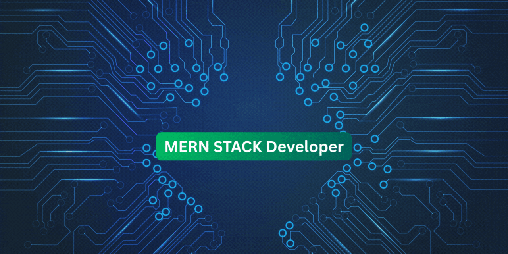

### 🛠 Tech Stack

  

## 👋 Hi, I'm Rukhsat Hossain Jim  
### 🚀 MERN Stack Developer

---

### 👨‍💻 About Me
I am a passionate MERN Stack Developer with over **6 months of hands-on experience** in building modern, responsive web applications.  
I have completed **8+ real-world projects** and enjoy turning ideas into functional products.  
Currently, I am learning **Next.js** to enhance my full-stack development skills.

---

### 🔭 Current Activities
- 🌱 Exploring **Next.js**
- 💻 Building full-stack projects using **MERN**
- 🚀 Improving performance & code quality
- 📚 Learning best practices in modern web development

---

### 🛠 Skills

#### Frontend

  

#### Backend

  

#### Tools & Others

  

---

### 🌐 Social Links

  
  
  

📍 **Location:** Bangladesh  

---

### 📊 GitHub Stats

---

### 📌 Featured Projects
⭐ Check out my pinned repositories to see my best client-side and MERN stack projects.

---

⭐ **Always open to learning, building, and collaborating on exciting projects!**
